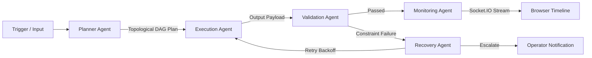

# Agentflow_AI — Agentic AI Operations Automation Platform

**Agentflow_AI** is a full-stack AI Operations Automation Platform that lets operators describe complex workflows in natural language and turns them into executable visual DAG graphs. The platform features an autonomous 5-agent execution chain (Planner, Execution, Validation, Recovery, Monitoring), OAuth integrations (Gmail, Slack, Discord, Google Sheets) with AES-256-GCM token encryption, background scheduling queues with automatic in-memory fallback, and live Socket.IO event streaming.

## 🚀 Live Demo

Experience Agentflow AI live: 👉 [Open Agentflow AI](https://agentflow-ai-flame.vercel.app)
> The project is currently available locally. A live deployment will be added soon.
---

## 🚀 Key Features

- **Natural Language to Workflow Generation**: Describe an operational pipeline in plain English and receive a complete visual graph with named nodes, positions, edges, and parameter configurations (supports OpenRouter, Google Gemini, and a zero-dependency deterministic rule builder).
- **Interactive Drag-and-Drop Canvas**: Built with React Flow (`@xyflow/react`), custom styled node badges, animated edges, mini-map, and a side configuration inspector.
- **5-Agent Autonomous Orchestration**:
  1. **Planner Agent**: Analyzes graph topology, resolves dependency trees, and calculates a confidence score.
  2. **Execution Agent**: Executes nodes against real OAuth tools or AI reasoning models.
  3. **Validation Agent**: Verifies required output fields and schema constraints.
  4. **Recovery Agent**: Classifies runtime failures (`MISSING_FIELDS`, `API_FAILURE`, `AUTH_EXPIRED`, `RATE_LIMIT`, `TRANSIENT`) and applies exponential backoff retries or escalates to operators.
  5. **Monitoring Agent**: Emits real-time timeline events and persists telemetry audit logs.
- **Third-Party Integrations**: Gmail (send/read email), Slack (channel alerts/webhooks), Discord (bot alerts/war rooms), Google Sheets (append ledger rows/read ranges).
- **Security & At-Rest Encryption**: Sensitive OAuth tokens are encrypted with AES-256-GCM using `CREDENTIAL_ENCRYPTION_KEY`. Passwords are protected with bcrypt (cost 12), and session handling uses JWTs.
- **Zero-Friction Local Execution**: Automatic fallback to `mongodb-memory-server` and in-memory queue runners if local MongoDB or Redis instances are not running.

---

## 🛠️ Tech Stack

- **Frontend**: Next.js (Pages Router), React 19, Tailwind CSS, Zustand, Axios, React Flow (`@xyflow/react`), Socket.IO client, Lucide Icons.
- **Backend**: Node.js, Express, MongoDB / Mongoose, BullMQ on Redis (via ioredis) with In-Memory fallback, Socket.IO, Helmet, Morgan, Compression, express-validator, bcryptjs.
- **AI & Orchestration**: OpenRouter API, Google Generative AI SDK, LangChain, and LangGraph.
- **Security**: AES-256-GCM application-level credential encryption, Helmet headers, rate limiting.

---

## 📁 Repository Structure

```
project/
├── client/                     # Frontend Next.js Pages Router application
│   ├── src/
│   │   ├── components/
│   │   │   ├── AppShell/       # Operator navigation, header, notification drawer
│   │   │   ├── MetricGrid/     # Key performance & confidence telemetry cards
│   │   │   ├── NodePalette/    # Draggable node components
│   │   │   ├── NodeConfigPanel/# Side parameter & retry policy inspector
│   │   │   ├── WorkflowCanvas/ # React Flow canvas & custom node renderers
│   │   │   └── ProtectedRoute/ # Auth route guard
│   │   ├── pages/
│   │   │   ├── _app.js         # Global styles & auth hydration wrapper
│   │   │   ├── index.js        # Landing page & agent architecture showcase
│   │   │   ├── login.js        # Auth login with 1-click test credentials
│   │   │   ├── register.js     # User registration with role selection
│   │   │   ├── dashboard.js    # Operator Console with live execution summary
│   │   │   ├── integrations.js # Third-party OAuth & credential hub
│   │   │   ├── settings.js     # System health, encryption & security settings
│   │   │   ├── workflows/      # Workflows list, studio editor, & AI builder
│   │   │   └── executions/     # Execution history & live Socket.IO timeline
│   │   ├── store/              # Zustand persistent stores (auth & workflow)
│   │   └── services/           # Axios API client & Socket.IO singleton
│   └── package.json
│
├── server/                     # Backend Node.js / Express API & Agent Engine
│   ├── src/
│   │   ├── agents/             # Planner, Execution, Validation, Recovery, Monitoring
│   │   ├── config/             # DB (with memory fallback), Socket.IO, env
│   │   ├── controllers/        # Express request/response handlers
│   │   ├── integrations/       # Gmail, Slack, Discord, Google Sheets
│   │   ├── middleware/         # Auth & validation middlewares
│   │   ├── models/             # Mongoose schemas (User, Workflow, Execution, etc.)
│   │   ├── queues/             # BullMQ + In-memory queue fallback
│   │   ├── routes/             # REST endpoints
│   │   ├── scripts/            # Database seeders
│   │   └── services/           # Business logic & AES encryption service
│   └── package.json
│
├── package.json                # Root workspace orchestrator
├── spec.md                     # Source of truth specification sheet
└── README.md                   # Complete local setup guide
```

---

## ⚡ Quick Start: Running Locally

### 1. Prerequisites
- **Node.js**: `v18.0.0` or higher (`v20+` / `v24+` recommended)
- **npm**: `v9+` or higher

### 2. Clone and Install Dependencies

You can install all dependencies from the root directory with:

```bash
# Install workspace dependencies
npm run install:all
```

Or install separately:
```bash
# Install server dependencies
cd server && npm install

# Install client dependencies
cd ../client && npm install
```

---

### 3. Environment Variables Configuration

Default development environment files are pre-configured in `server/.env` and `client/.env.local`.

#### Backend (`server/.env`):
```env
PORT=5001
NODE_ENV=development
CLIENT_URL=http://localhost:3000
MONGO_URI=mongodb://localhost:27017/agentflow_ai
JWT_SECRET=agentflow_jwt_secret_dev_key_change_in_production_892347923
JWT_EXPIRES_IN=7d
CREDENTIAL_ENCRYPTION_KEY=0123456789abcdef0123456789abcdef0123456789abcdef0123456789abcdef
REDIS_URL=redis://localhost:6379

# AI Keys (Optional: Deterministic Rule Engine is used when absent)
OPENROUTER_API_KEY=
GEMINI_API_KEY=

# OAuth Provider Credentials (Optional: Sandbox simulator used when absent)
GOOGLE_CLIENT_ID=
GOOGLE_CLIENT_SECRET=
SLACK_CLIENT_ID=
SLACK_CLIENT_SECRET=
DISCORD_CLIENT_ID=
DISCORD_CLIENT_SECRET=
DISCORD_BOT_TOKEN=
```

#### Frontend (`client/.env.local`):
```env
NEXT_PUBLIC_API_URL=http://localhost:5001/api
NEXT_PUBLIC_SOCKET_URL=http://localhost:5001
```

---

### 4. Start the Application

Open two terminal windows:

#### Terminal 1 — Backend Server (Port 5001):
```bash
cd server
npm run dev
```
*Note: If local MongoDB or Redis is not running, the backend automatically starts an in-memory MongoDB instance (`mongodb-memory-server`) and in-memory queue fallback, and seeds starter workflows and operator accounts.*

#### Terminal 2 — Frontend Client (Port 3000):
```bash
cd client
npm run dev
```

Visit **[http://localhost:3000](http://localhost:3000)** in your browser.

---

## 🔑 Default Test Credentials

The database is pre-seeded with two ready-to-use operator accounts for immediate testing:

| Role | Email | Password |
| :--- | :--- | :--- |
| **Admin Operator** | `admin@agentflow.ai` | `AdminPass123!` |
| **Standard Operator** | `operator@agentflow.ai` | `OperatorPass123!` |

*(You can also use the **1-Click Demo Access** buttons directly on the `/login` page).*

---

## 🌐 API Endpoints Reference

### Health & Authentication
- `GET /api/health` — System status, LangGraph substrate check, queue mode, and uptime.
- `POST /api/auth/register` — Register a new operator account (`name`, `email`, `password`, `role`).
- `POST /api/auth/login` — Authenticate and receive signed JWT.
- `GET /api/auth/me` — Fetch authenticated user profile.

### Workflows
- `GET /api/workflows/dashboard` — Aggregated metrics (total automations, active runs, success rate).
- `GET /api/workflows` — List workflows with search, status filters, and pagination.
- `POST /api/workflows` — Create a workflow manually.
- `POST /api/workflows/generate` — Generate visual workflow graph from natural language prompt.
- `GET /api/workflows/:id` — Fetch single workflow graph details.
- `PUT /api/workflows/:id` — Update workflow nodes, edges, or trigger configuration (auto-increments version).
- `POST /api/workflows/:id/duplicate` — Clone an existing workflow.
- `POST /api/workflows/:id/execute` — Trigger an execution run.
- `DELETE /api/workflows/:id` — Delete a workflow.

### Executions & Timeline
- `GET /api/executions` — List execution history with filters.
- `GET /api/executions/:id` — Fetch execution state, input/output data, and workflow snapshot.
- `GET /api/executions/:id/timeline` — Fetch granular multi-agent timeline logs.
- `POST /api/executions/:id/pause` — Pause an active execution.
- `POST /api/executions/:id/resume` — Resume a paused execution.
- `POST /api/executions/:id/cancel` — Cancel a running execution.

### Integrations & Notifications
- `GET /api/integrations` — List connected third-party providers.
- `GET /api/integrations/status` — Health and token encryption validation.
- `GET /api/integrations/oauth/:provider/start` — Initiate OAuth flow.
- `GET /api/integrations/oauth/:provider/callback` — Complete OAuth handshake and store encrypted tokens.
- `POST /api/integrations` — Save manual API keys / webhooks securely.
- `DELETE /api/integrations/:provider` — Disconnect integration.
- `GET /api/notifications` — Fetch user alert stream.
- `PUT /api/notifications/:id/read` — Mark alert as read.
- `POST /api/notifications/read-all` — Mark all alerts as read.

---

## 🤖 5-Agent Execution Lifecycle



1. **Planner Agent**: Analyzes node connections, validates that the graph is an acyclic DAG, and computes execution ordering with confidence scoring.
2. **Execution Agent**: Runs each node in sequence against configured tools (Gmail, Slack, Discord, Google Sheets) or AI reasoning models.
3. **Validation Agent**: Checks required fields (e.g. email recipient, spreadsheet ID, valid JSON format).
4. **Recovery Agent**: Classifies errors (`MISSING_FIELDS`, `AUTH_EXPIRED`, `RATE_LIMIT`, `API_FAILURE`, `TRANSIENT`) and applies exponential backoff or operator escalation.
5. **Monitoring Agent**: Emits real-time Socket.IO events to the execution room and writes audit entries to `ExecutionLogs`.
